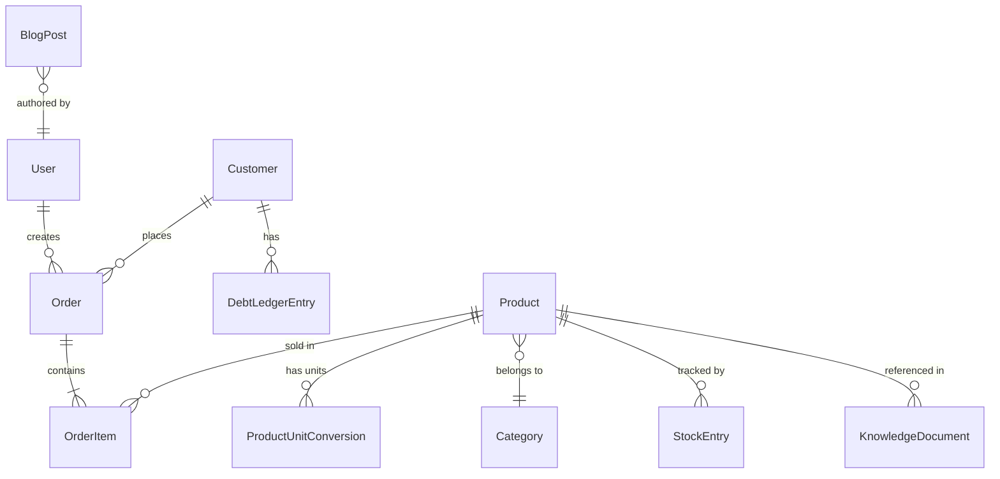

# Phase 1: Data Model — Agrix Core Platform

**Date**: 2026-03-19
**Feature**: [spec.md](spec.md)

## Entity Relationship Overview



## Entities

### User (Authentication & RBAC)

| Field | Type | Constraints | Description |
|-------|------|-------------|-------------|
| id | UUID | PK | Unique identifier |
| username | String | UNIQUE, NOT NULL | Login username |
| password_hash | String | NOT NULL | Bcrypt hashed password |
| full_name | String | NOT NULL | Display name |
| role | Enum | NOT NULL | `ADMIN`, `CASHIER`, `INVENTORY` |
| is_active | Boolean | DEFAULT true | Soft disable account |
| created_at | Timestamp | NOT NULL | Account creation time |
| updated_at | Timestamp | NOT NULL | Last modification |

### Category

| Field | Type | Constraints | Description |
|-------|------|-------------|-------------|
| id | UUID | PK | Unique identifier |
| name | String | UNIQUE, NOT NULL | e.g., "Phân bón", "Thuốc BVTV" |
| description | String | NULLABLE | Optional description |
| parent_id | UUID | FK → Category, NULLABLE | For sub-categories |

### Product

| Field | Type | Constraints | Description |
|-------|------|-------------|-------------|
| id | UUID | PK | Unique identifier |
| sku | String | UNIQUE, NOT NULL | Product code (SKU) |
| name | String | NOT NULL | Product display name |
| category_id | UUID | FK → Category | Product category |
| base_unit | String | NOT NULL | Smallest sellable unit (e.g., "Chai") |
| base_cost_price | Integer | NOT NULL | Cost price in VND per base unit |
| base_sell_price | Integer | NOT NULL | Retail price in VND per base unit |
| current_stock_base | Integer | NOT NULL, DEFAULT 0 | Current stock in base units |
| min_stock_threshold | Integer | DEFAULT 0 | Alert when stock falls below |
| expiration_date | Date | NULLABLE | For perishable goods |
| expiration_alert_days | Integer | DEFAULT 30 | Days before expiry to alert |
| usage_instructions | Text | NULLABLE | How to use the product |
| description | Text | NULLABLE | Additional product info |
| barcode_ean13 | String | NULLABLE, UNIQUE | Manufacturer barcode |
| qr_code_internal | String | NULLABLE, UNIQUE | Internal QR identifier |
| image_url | String | NULLABLE | MinIO object URL |
| is_active | Boolean | DEFAULT true | Soft delete |
| created_at | Timestamp | NOT NULL | |
| updated_at | Timestamp | NOT NULL | |

### ProductUnitConversion

| Field | Type | Constraints | Description |
|-------|------|-------------|-------------|
| id | UUID | PK | Unique identifier |
| product_id | UUID | FK → Product | Parent product |
| unit_name | String | NOT NULL | e.g., "Thùng" (Box) |
| conversion_factor | Integer | NOT NULL | How many base units in 1 of this unit (e.g., 40) |

_Note_: Pricing for larger units is derived: `base_sell_price * conversion_factor`. Discounts on bulk units can be handled via an optional `override_sell_price` field in the future.

### StockEntry (Inventory Ledger)

| Field | Type | Constraints | Description |
|-------|------|-------------|-------------|
| id | UUID | PK | Unique identifier |
| product_id | UUID | FK → Product | Product being stocked |
| quantity_base | Integer | NOT NULL | Quantity in base units (positive = in, negative = out) |
| type | Enum | NOT NULL | `IMPORT`, `SALE`, `ADJUSTMENT`, `SYNC` |
| batch_number | String | NULLABLE | Lot/batch identifier |
| reference_id | UUID | NULLABLE | OrderID or ImportID for traceability |
| created_by | UUID | FK → User | Who performed this action |
| created_at | Timestamp | NOT NULL | |

_Note_: `Product.current_stock_base` is the materialized sum of all `StockEntry.quantity_base`. Every stock change creates a new ledger entry for full traceability (Constitution IV).

### Customer

| Field | Type | Constraints | Description |
|-------|------|-------------|-------------|
| id | UUID | PK | Unique identifier |
| name | String | NOT NULL | Customer name |
| phone | String | NULLABLE, UNIQUE | Phone number |
| address | String | NULLABLE | Address |
| outstanding_debt | Integer | DEFAULT 0 | Current total debt in VND |
| created_at | Timestamp | NOT NULL | |
| updated_at | Timestamp | NOT NULL | |

### Order

| Field | Type | Constraints | Description |
|-------|------|-------------|-------------|
| id | UUID | PK | Generated on client (for offline) |
| customer_id | UUID | FK → Customer, NULLABLE | Walk-in customers have no ID |
| total_amount | Integer | NOT NULL | Total in VND |
| paid_amount | Integer | NOT NULL | Amount paid now |
| payment_method | Enum | NOT NULL | `CASH`, `BANK_TRANSFER`, `MIXED` |
| sync_status | Enum | NOT NULL | `SYNCED`, `PENDING` |
| idempotency_key | UUID | UNIQUE, NOT NULL | Prevents duplicate sync |
| created_by | UUID | FK → User | Cashier who created |
| created_at | Timestamp | NOT NULL | |

### OrderItem

| Field | Type | Constraints | Description |
|-------|------|-------------|-------------|
| id | UUID | PK | Unique identifier |
| order_id | UUID | FK → Order | Parent order |
| product_id | UUID | FK → Product | Product sold |
| quantity_base | Integer | NOT NULL | Quantity in base units |
| sold_unit | String | NOT NULL | Unit displayed to cashier (e.g., "Chai") |
| unit_price | Integer | NOT NULL | Price per sold unit at time of sale |
| line_total | Integer | NOT NULL | quantity * unit_price |

### DebtLedgerEntry

| Field | Type | Constraints | Description |
|-------|------|-------------|-------------|
| id | UUID | PK | Unique identifier |
| customer_id | UUID | FK → Customer | Customer |
| order_id | UUID | FK → Order, NULLABLE | Related order (if debt from sale) |
| amount | Integer | NOT NULL | Positive = debt increase, Negative = payment |
| type | Enum | NOT NULL | `SALE_DEBT`, `PAYMENT`, `ADJUSTMENT` |
| note | String | NULLABLE | e.g., "Trả một phần tiền phân đạm" |
| created_by | UUID | FK → User | |
| created_at | Timestamp | NOT NULL | |

### KnowledgeDocument (AI RAG)

| Field | Type | Constraints | Description |
|-------|------|-------------|-------------|
| id | UUID | PK | Unique identifier |
| title | String | NOT NULL | Document name |
| file_url | String | NULLABLE | MinIO URL if uploaded file |
| content_text | Text | NULLABLE | Raw text content |
| product_id | UUID | FK → Product, NULLABLE | Linked product (optional) |
| uploaded_by | UUID | FK → User | |
| created_at | Timestamp | NOT NULL | |

### KnowledgeEmbedding (Vector chunks)

| Field | Type | Constraints | Description |
|-------|------|-------------|-------------|
| id | UUID | PK | Unique identifier |
| document_id | UUID | FK → KnowledgeDocument | Parent document |
| chunk_text | Text | NOT NULL | Text chunk |
| embedding | Vector(1536) | NOT NULL | OpenAI embedding vector |
| chunk_index | Integer | NOT NULL | Position in document |

### BlogPost

| Field | Type | Constraints | Description |
|-------|------|-------------|-------------|
| id | UUID | PK | Unique identifier |
| title | String | NOT NULL | Blog title |
| slug | String | UNIQUE, NOT NULL | URL-friendly slug |
| content | Text | NOT NULL | Markdown/HTML content |
| category | String | NOT NULL | e.g., "Cách bón phân", "Phòng bệnh" |
| cover_image_url | String | NULLABLE | MinIO URL |
| is_published | Boolean | DEFAULT false | |
| author_id | UUID | FK → User | |
| published_at | Timestamp | NULLABLE | |
| created_at | Timestamp | NOT NULL | |
| updated_at | Timestamp | NOT NULL | |

## State Transitions

### Order.sync_status

```
PENDING → SYNCED  (Background sync success)
PENDING → PENDING (Sync retry on failure)
```

### StockEntry Lifecycle

```
IMPORT  → Product.current_stock_base += quantity_base
SALE    → Product.current_stock_base -= quantity_base
SYNC    → Server reconciles offline SALE entries
ADJUSTMENT → Manual correction by admin
```

## Validation Rules

- `ProductUnitConversion.conversion_factor` MUST be > 0.
- `Order.paid_amount` MUST be >= 0 and <= `total_amount`.
- `Order.idempotency_key` MUST be generated client-side as UUIDv4.
- `Product.current_stock_base` CAN go negative during offline mode (resolved during sync reconciliation).
- `DebtLedgerEntry`: Sum of all entries for a customer MUST equal `Customer.outstanding_debt`.
