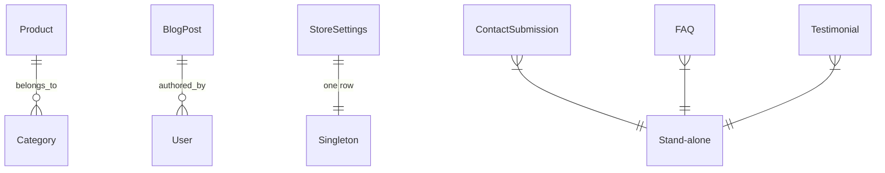

# Data Model: Landing Page Redesign

**Feature**: 004-landing-page-redesign
**Date**: 2026-03-21

## Existing Entities (Reused)

### Product (inventory module — no changes)
| Field | Type | Notes |
|-------|------|-------|
| id | UUID | PK |
| name | string | Product name |
| baseSellPrice | decimal | Display price |
| baseUnit | string | e.g. "Chai", "Kg" |
| description | text | nullable, for detail page |
| imageUrl | string | nullable, product image |
| category | relation | ManyToOne → Category |
| currentStockBase | number | Stock quantity |
| isActive | boolean | Filter for public display |

### BlogPost (blog module — no changes)
| Field | Type | Notes |
|-------|------|-------|
| id | UUID | PK |
| title | string | |
| slug | string | URL-friendly |
| excerpt | text | Short description |
| content | text | Full HTML content |
| thumbnailUrl | string | nullable |
| publishedAt | datetime | nullable |
| status | enum | DRAFT / PUBLISHED |
| author | relation | ManyToOne → User |

## New Entities

### ContactSubmission (contact module)
| Field | Type | Validation | Notes |
|-------|------|------------|-------|
| id | UUID | PK, auto | |
| customerName | string(255) | required, max 255 | Sender name |
| phoneNumber | string(20) | required, matches VN phone regex | e.g. 0912345678 |
| email | string(255) | optional, valid email | |
| message | text | required, max 2000 chars | |
| status | enum | default: NEW | NEW, READ, REPLIED |
| createdAt | datetime | auto | |
| updatedAt | datetime | auto | |

### FAQ (faq module)
| Field | Type | Validation | Notes |
|-------|------|------------|-------|
| id | UUID | PK, auto | |
| question | string(500) | required | |
| answer | text | required | |
| order | integer | default: 0 | Display order on landing page |
| isActive | boolean | default: true | |
| createdAt | datetime | auto | |
| updatedAt | datetime | auto | |

### Testimonial (testimonial module)
| Field | Type | Validation | Notes |
|-------|------|------------|-------|
| id | UUID | PK, auto | |
| customerName | string(255) | required | |
| content | text | required, max 500 | |
| rating | integer | 1-5, default: 5 | Star rating |
| avatarUrl | string | nullable | Customer photo |
| isActive | boolean | default: true | |
| createdAt | datetime | auto | |
| updatedAt | datetime | auto | |

### StoreSettings (common module — singleton)
| Field | Type | Validation | Notes |
|-------|------|------------|-------|
| id | UUID | PK, auto | Single row |
| storeName | string(255) | required | e.g. "Agrix Nông Nghiệp" |
| address | string(500) | required | Full address |
| phoneNumber | string(20) | required | |
| email | string(255) | optional | |
| description | text | nullable | About us text |
| heroTitle | string(255) | nullable | Banner headline |
| heroSubtitle | text | nullable | Banner description |
| heroImageUrl | string | nullable | Banner background image |
| createdAt | datetime | auto | |
| updatedAt | datetime | auto | |

## Relationships



## State Transitions

### ContactSubmission.status
```
NEW → READ → REPLIED
```
- `NEW`: Just submitted by user
- `READ`: Admin has viewed
- `REPLIED`: Admin has responded (future enhancement)
