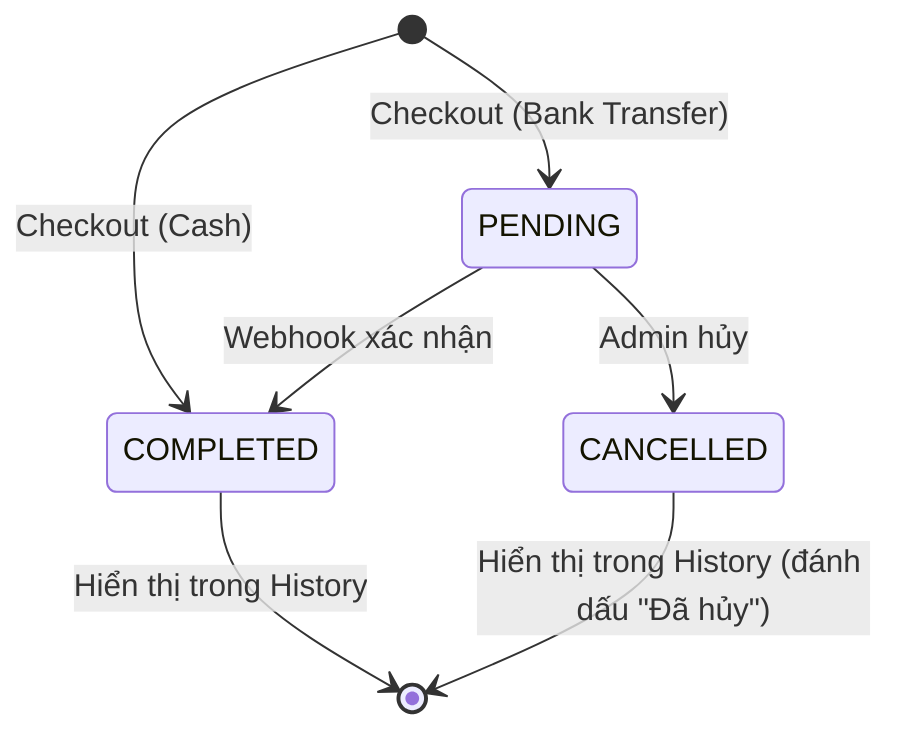

# Data Model: POS History

**Branch**: `009-pos-history` | **Date**: 2026-04-05

## Existing Entities (No Changes Required)

Tính năng History hoàn toàn read-only, sử dụng các entity đã có sẵn:

### Order (`orders` table)

| Field | Type | Description |
|-------|------|-------------|
| id | UUID (PK) | Primary key |
| orderCode | VARCHAR(10) | Mã đơn hàng hiển thị (VD: DH123456) |
| status | ENUM(PENDING, COMPLETED, CANCELLED) | Trạng thái đơn |
| customerId | UUID (FK, nullable) | Liên kết khách hàng |
| totalAmount | INT | Tổng tiền (VNĐ) |
| paidAmount | INT | Số tiền đã thanh toán |
| paymentMethod | ENUM(CASH, BANK_TRANSFER, MIXED) | Phương thức thanh toán |
| syncStatus | ENUM(SYNCED, PENDING) | Trạng thái đồng bộ |
| idempotencyKey | VARCHAR (unique) | Khoá chống trùng lặp |
| createdBy | UUID (FK) | Thu ngân tạo đơn |
| createdAt | TIMESTAMP | Thời gian tạo |

**Relations**:
- `items`: OneToMany → OrderItem (cascade, eager)
- `customer`: ManyToOne → Customer (nullable)
- `creator`: ManyToOne → User

### OrderItem (`order_items` table)

| Field | Type | Description |
|-------|------|-------------|
| id | UUID (PK) | Primary key |
| orderId | UUID (FK) | Liên kết đơn hàng |
| productId | UUID (FK) | Sản phẩm |
| quantityBase | INT | Số lượng (đơn vị gốc) |
| soldUnit | VARCHAR | Đơn vị bán |
| unitPrice | INT | Đơn giá |
| lineTotal | INT | Thành tiền dòng |

**Relations**:
- `order`: ManyToOne → Order (cascade DELETE)
- `product`: ManyToOne → Product

### Customer (`customers` table — relevant fields)

| Field | Type | Description |
|-------|------|-------------|
| id | UUID (PK) | Primary key |
| name | VARCHAR | Tên khách hàng |
| phone | VARCHAR (nullable) | Số điện thoại |
| outstandingDebt | INT | Số tiền nợ |

## Schema Changes

### Backend: `findOrders()` Search Enhancement

Thêm 1 điều kiện tìm kiếm vào `OrderService.findOrders()`:

```diff
  if (search) {
    qb.andWhere(new Brackets(qb => {
      qb.where('CAST(order.id AS VARCHAR) LIKE :search', { search: `%${search}%` })
        .orWhere('LOWER(customer.name) LIKE LOWER(:search)', { search: `%${search}%` })
-       .orWhere('LOWER(order.orderCode) LIKE LOWER(:search)', { search: `%${search}%` });
+       .orWhere('LOWER(order.orderCode) LIKE LOWER(:search)', { search: `%${search}%` })
+       .orWhere('customer.phone LIKE :search', { search: `%${search}%` });
    }));
  }
```

Không cần migration — không thay đổi schema database.

## State Transitions



Trên trang History, tất cả trạng thái đều được hiển thị, với badge màu phân biệt:
- **COMPLETED** → Emerald badge
- **PENDING** → Amber badge
- **CANCELLED** → Red badge
